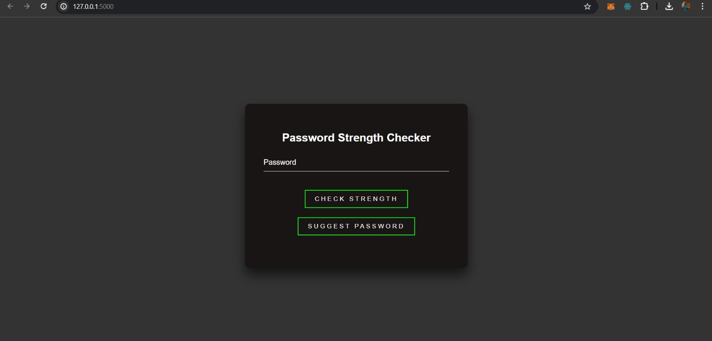
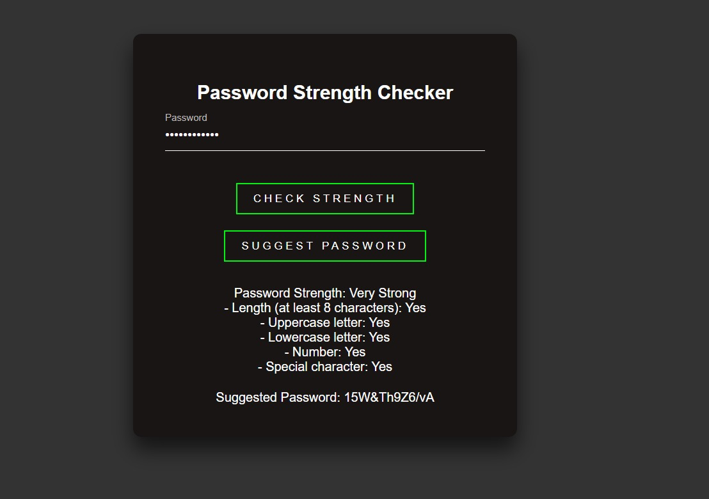
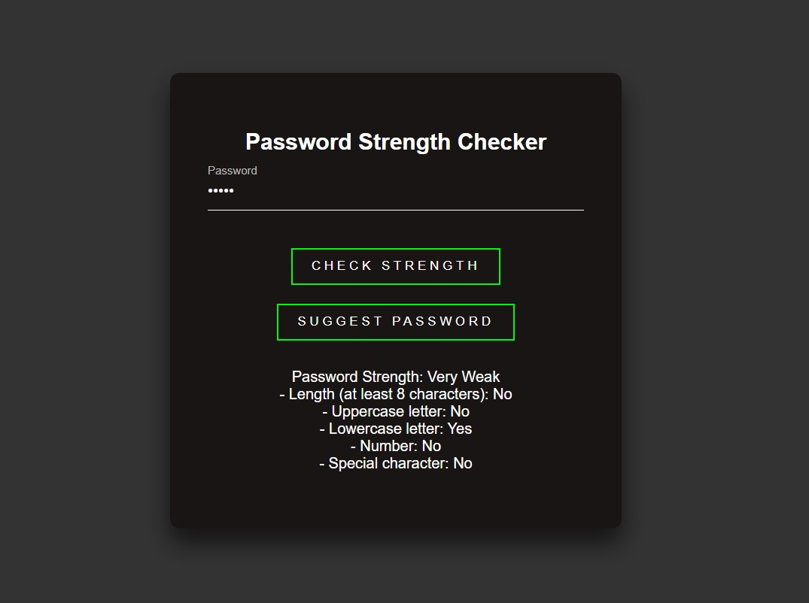

# Password Strength Checker

## Problem Statement

Build a tool that assesses the strength of a password based on criteria such as length, presence of uppercase and lowercase letters, numbers, and special characters. Provide feedback to users on the password's strength.

## Working of the Project

The Password Strength Checker is a web application designed to evaluate the strength of user-provided passwords. It analyzes various aspects of the password, including its length, the presence of different types of characters (uppercase letters, lowercase letters, numbers, and special characters), and provides feedback to the user regarding its strength.

### Features
- **Password Strength Assessment**: Analyzes the provided password and provides feedback on its strength.
- **Length Check**: Ensures that the password meets the minimum length requirement.
- **Character Requirements**: Checks for the presence of uppercase letters, lowercase letters, numbers, and special characters in the password.
- **Feedback**: Provides immediate feedback to the user on the strength of the password.

### Interface Images
#### Password Strength Checker GUI

### Running the Application

To run the Password Strength Checker, follow these steps:
1. Open the provided web application in your web browser.
2. Enter a password in the input field.
3. Click the "Check Strength" button to evaluate the password.
4. Review the feedback provided by the tool regarding the strength of the password.

### LinkedIn

[LinkedIn](https://linkedin.com/in/yash-borkar-048094225)
